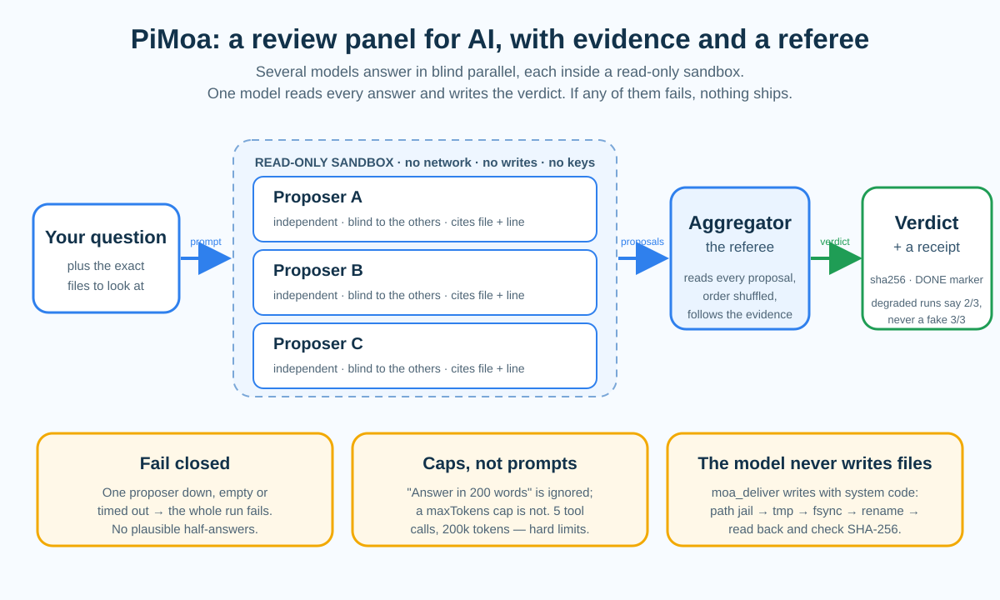
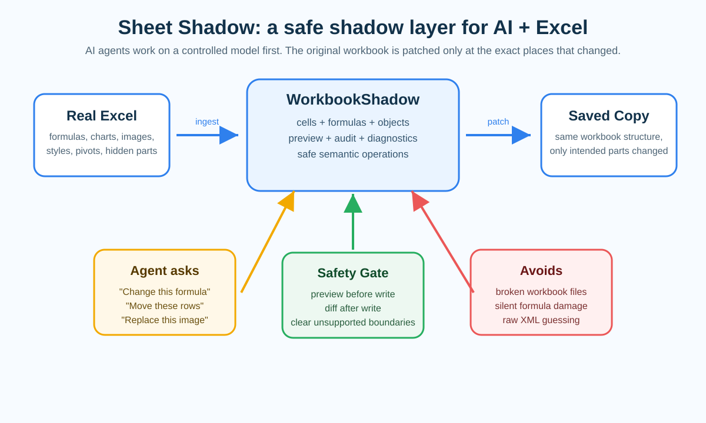

# Build-Agent-Tools-PiMoa

**Two MCP servers I built because I did not trust AI with my own files.**
One stops an agent from wrecking a real spreadsheet. The other makes several
models argue — blind, with evidence, inside a sandbox — before anything counts.

Working tools · source and docs in English and 中文 · built and rebuilt across 2025–2026

**English** · [中文](#中文) · [`sheet_shadow`](./sheet_shadow) · [`PiMoa`](./PiMoa)

---

## Two afternoons

### 1. The spreadsheet that opened fine, and was still wrong

I gave an agent a workbook I actually needed — a budget file with formulas, a
chart, merged headers, a couple of hidden helper sheets — and asked it to change
one number.

It changed the number. It also rewrote the entire file.

Everything still opened. Nothing threw an error. But the chart was now pointing at
the wrong range, two formulas had quietly turned into hard-coded numbers, and a
hidden sheet had become visible. The file was *fine*, and it was *wrong*, and no
tool in the pipeline would ever have told me.

The obvious next idea — *let the agent edit the XML directly, that is the real
format anyway* — is worse. An `.xlsx` is a zip archive of a dozen XML parts wired
together by relationships. Break one relationship and the workbook still opens; it
just silently loses things.

### 2. The code review that was confidently wrong

Then I pointed a panel of AI models at a thousand-line file and asked for a
security review.

It came back with a confident answer, citing line numbers. **The line numbers were
off by about 130 lines.** The code had been handed over without line numbers, so
the model had *counted them itself*, and everything downstream of that was built on
sand.

A later attempt was worse. It burned 53 seconds and returned **nothing at all** —
no error, no partial result, just an empty box where a verdict should have been.

### The idea that connects them

Both failures are the same failure: **an agent was trusted for a whole session
instead of for one change.**

So both projects are built around the opposite rule:

> **Trust is earned per change, not per session.**
> Let the agent work somewhere it cannot do damage. Make it show its evidence.
> And let ordinary code — not the model — do the part that touches your world.

`sheet_shadow` applies that rule to Excel. `PiMoa` applies it to opinions.

---

## PiMoa — when one model is not enough

### First, the one piece of jargon

**MCP (Model Context Protocol) is just a plug standard.** A chat model on its own
can only talk. MCP is the agreed shape of a socket that lets it *use things* — read
a file, run a search, call a program you wrote. Both projects here are MCP servers:
small local programs that hand an AI a few careful, narrow abilities instead of the
whole computer. Any MCP-capable agent can mount them.

### The idea: ask three doctors, not one

PiMoa is an implementation of **Mixture-of-Agents** (Together AI, 2024,
[arXiv:2406.04692](https://arxiv.org/abs/2406.04692)).

The observation behind that paper is easy to say out loud: **a model gives a better
answer when it can see other models' answers** — even worse ones.

So you do not ask one model. You ask two or three to write their opinions
**separately** (so nobody copies anybody), and then a fourth model — the
**aggregator** — reads all of them and writes the final verdict.

Why does that work? Because **models make different mistakes.** If model A invents
an API that does not exist, model B will usually invent a *different* one. The
aggregator, facing two stories that contradict each other, goes looking for the one
that comes with a real file name and a real line number.

**Disagreement is not noise. It is the signal that tells you an answer is
contested.** A single model gives you one answer and never mentions that it had
competitors.

### But a panel of doctors is not enough

That much is a paper. What follows is most of the actual work in PiMoa, and it is
what makes the thing usable on files you care about.

**1. Opinion is cheap. Evidence decides.**
A proposer is not allowed to guess. In `moa_verify`, every model works inside a
**read-only sandbox**: it may look at the files you pointed at, and nothing else.
No network. No writing to disk. No reading your home directory. Its API keys are
stripped out of its environment before it starts. It gathers evidence with three
tools that each do one job — `rg` for text, `ast-grep` for code structure, `rtk`
for compact reads — and every claim has to arrive with a file and a line number.

**2. Give the model what you want it to be accurate about.**
Those wrong line numbers were not a model being stupid. We fed it bare code and
asked it to *count*. Feed the same code with the line numbers already printed down
the side (`688| func …`) and the drift disappears, because it copies instead of
counting. The general rule is worth keeping:

> Anything you need to be exact, put the answer in the input rather than asking
> for it in the output.

**3. Caps beat prompts.**
"Please answer in under 200 words" gets ignored — one model wrote 6,946 characters
anyway. A `maxTokens` cap does not get ignored. It is the same with how long a
model may dig around: the briefing says *stop searching*, the model keeps
searching, and what actually holds is a hard ceiling of five tool calls and a
200k-token evidence budget.

And the two safety rules everything else hangs on:

- **Fail closed.** If one proposer comes back empty, times out, or errors, the
  whole run fails. PiMoa will hand you *nothing* before it hands you a
  plausible-sounding half-answer. There is an opt-in `tolerate-one` for synthesis
  work only; it always stamps `2/3 (degraded)` on the receipt, and never lies
  with `3/3`.
- **The model never touches your disk.** `moa_deliver` writes the final document
  with ordinary system code: path jail, exclusive temp file, `fsync`, atomic
  rename, then read the file back and check its SHA-256 and a trailing `DONE_…`
  marker. The AI writes the words. The machine writes the file.

### Three tools, one sentence each

| Tool | What it is |
|---|---|
| `moa_run` | **Ask the panel.** Proposers get no tools at all — they answer only from what you put in front of them. |
| `moa_verify` | **Ask the panel and let it check.** Proposers gather read-only evidence in the sandbox before answering. |
| `moa_deliver` | **Ask the panel and let it ship.** Same as above, plus an atomic, checksum-verified write performed by system code. |

### What the numbers actually look like

v1 of PiMoa worked on toy questions and fell over on real ones. Chasing *why* was
the most useful debugging I have done. On a real audit — a 1004-line file, hunting
a real prompt-injection gap:

| | v1 | v2 |
|---|---|---|
| Result | ❌ failed, empty answer | ✅ correct |
| Wall time | 53.2 s (wasted) | **22.7 s** |
| Input tokens | 251,808 | ~27,000 |
| Cited line numbers | off by 130 | exact, checked line by line |

Faster *because* the architecture got more honest about where verification
belongs, not because something got optimised. Three lessons came out of that, and
they apply well beyond this project:

1. **Draw the task boundary before the model starts.** This was the single biggest
   lever. An agent inside Claude Code or Codex *scouts first* — greps, narrows to
   three files, then delegates. An external review panel gets the raw open-ended
   question and has to find everything itself. So PiMoa now does the scouting
   server-side, mechanically, before any model runs: you pass the file list, and it
   attaches the right excerpts with real line numbers.
2. **Don't ask a model to compute what you can hand it.** See the line numbers.
3. **Caps beat prompts.** See the word count.

### The part I am proudest of: it found a bug in itself

I pointed v2 at its own source code. It found a defect I had written and that all
381 tests had missed: a degradation path and a sibling-abort path shared one
`AbortController`, so *any* proposer failure cancelled the aggregator before it
even started — the fallback was dead from the day it shipped. The tests missed it
because the mock did not respect the abort signal.

Two proposers **disagreed**. One called it fatal. The other found nothing wrong.
The aggregator sided with the one carrying the harder evidence chain, and it was
right.

That disagreement is the entire point. One model would have handed me a single
answer and never mentioned that the answer was contested. I fixed the defect and
added signal-aware tests to close the blind spot.

Security was treated the same way. Three rounds of adversarial review closed 15
findings, **four of them demonstrated remote-code-execution holes**; a fourth round
aimed at the new search tools found two more (an `ast-grep` flag alias bypass and a
config-file dynamic-library autoloading path). All fixed. The write-ups are public
in [`PiMoa/reviews/`](./PiMoa/reviews).

### When not to use it

- **MoA is expensive and slow** — it is N+1 model calls per question. Save it for
  things that genuinely benefit from a second opinion, not for trivia.
- **Verify only sees the folder you give it.** That is the price of the sandbox,
  and exactly the point of it.
- **macOS only, for now.** The sandbox is `sandbox-exec`. On any other platform the
  command execution is *refused outright* rather than run unprotected. A Linux
  sandbox is on the backlog.
- **It is a developer-side tool**, meant to sit on your own machine next to your
  own code. Not built for exposure on the open internet.

---

## sheet_shadow — let the agent edit Excel without handing it a chainsaw

An agent that edits a workbook directly will, sooner or later, overwrite something
it did not understand. Sheet Shadow puts a layer in between. The agent works on a
**shadow model** of the workbook first, sees a preview of what would change, and
only the parts that were meant to change get patched into a **new copy** of the
file.

By default the original is never overwritten. The safe path is the default, not a
hope.

What that buys you:

- **Preview before write.** You see the diff and structured diagnostics before
  anything is saved.
- **Targeted saving.** The original package is copied and only the touched parts
  are patched, so formulas, charts, styles and hidden sheets survive.
- **Honest diagnostics.** Formulas outside the supported set are reported as
  unsupported, never silently guessed at.
- **A delivery gate.** A saved workbook is checked for formula errors, package
  drift, stale sessions and macro/VBA changes before it is handed over, and comes
  back `passed`, `needs_review`, or `failed`.
- **Real speed.** Ingesting a 24-sheet workbook went from about 35 seconds to
  about 5 after the dependency graph was rebuilt.

In one line, from the [full Sheet Shadow README](./sheet_shadow/README.md):

> xlsx skills teach the agent how to behave around spreadsheets. Sheet Shadow gives
> the agent a safer spreadsheet runtime to behave through.

---

## Why these live next to a paper about unemployment

The same profile that ships these tools also hosts
[Research-AI-and-Employment](https://github.com/jerryxugit-2026/Research-AI-and-Employment),
a working paper on what automating entry-level information work does to the people
who used to do it.

That is deliberate. Both of these tools are, underneath, the same question asked
from two directions: *what happens to the person whose judgement used to be the
last line of defence?* Sheet Shadow answers it for the person whose spreadsheet
would otherwise be silently damaged. PiMoa answers it for the person who would
otherwise accept a confident, unverified answer.

Building the tools and counting their cost are the same job, done honestly.

---

## Where things are

| Path | What is in it |
|---|---|
| [`PiMoa/`](./PiMoa) | The MoA server. [README](./PiMoa/README.md) (EN + 中文) · [DESIGN](./PiMoa/DESIGN.md) · [architecture](./PiMoa/PiMoa%20系统架构.md) · [adversarial reviews](./PiMoa/reviews) |
| [`PiMoa/docs/pimoa-principle.svg`](./PiMoa/docs/pimoa-principle.svg) | The one-page diagram of how a PiMoa run works |
| [`sheet_shadow/`](./sheet_shadow) | The Excel safety layer. [README](./sheet_shadow/README.md) (EN + 中文) · [principle diagram](./sheet_shadow/docs/sheet-shadow-principle.svg) |
| [`sheet_shadow/sheet_shadow_core`](./sheet_shadow/sheet_shadow_core) | The workbook engine (legacy Rust/Python line) |
| [`sheet_shadow/scripts`](./sheet_shadow/scripts) | Audit and smoke-check tools for high-risk workbooks |

Release snapshots (with full source at each tag) are kept under the earlier
[`Ai-learning`](https://github.com/jerryxugit-2026/Ai-learning) repository:
[`pimoa-v2`](https://github.com/jerryxugit-2026/Ai-learning/releases/tag/pimoa-v2) ·
[`pimoa-v1`](https://github.com/jerryxugit-2026/Ai-learning/releases/tag/pimoa-v1).

## Honest limits, in one place

- **This is a public learning and research release.** Test on copies of anything
  that matters, and never leave it as the only backup of a real file.
- **Both tools are narrow on purpose.** Sheet Shadow is about *existing* `.xlsx`
  files, not about generating reports from scratch. PiMoa is about questions worth
  paying several models to check, not about everyday chat.
- **Platform reality:** PiMoa's sandbox is macOS (`sandbox-exec`); elsewhere it
  refuses to execute rather than run wide open.
- **Nothing here is magic.** It is careful plumbing around models that are
  powerful, useful, and wrong in ways that sound confident.

*Dates, plainly: these tools were built and rebuilt across 2025–2026. This
repository is where they live now, since June 2026.*

---

*One of four directions on [my profile](https://github.com/jerryxugit-2026) —
physics, art history, AI tooling, and public systems.*

---

# 中文

**两个 MCP server，都是因为我不敢把 AI 放到自己的真实文件上，才动手写的。**
一个拦住 agent 毁掉你的 Excel；另一个让好几个模型先吵一架 —— 互相看不见、必须带证据、
只能在沙箱里翻 —— 之后结论才算数。

能跑的工具 · 中英文档齐全 · 2025–2026 年间反复推倒重来

[English](#build-agent-tools-pimoa) · **中文** · [`sheet_shadow`](./sheet_shadow) · [`PiMoa`](./PiMoa)

---

## 两个下午

### 一、那个能正常打开、但已经坏了的表格

我把一个真实要用的工作簿交给 agent —— 有公式、有图表、有合并表头、还有两张隐藏的辅助表 ——
只让它改一个数字。

它改了那个数字。它也顺手把整个文件重写了。

一切都能打开，没有任何报错。但图表指向的区域变了，两个公式悄悄变成了写死的数字，
一张隐藏表不再隐藏。文件**看起来是好的**，而它是**错的**，流水线上没有任何工具会告诉我这件事。

再往前一步的想法 —— *让 agent 直接改 XML，那才是文件的真身* —— 更糟。
一个 `.xlsx` 是十来个 XML 部件被一堆关系串起来的压缩包。弄断一条关系，工作簿照样能打开，
它只是悄悄丢东西。

### 二、那次非常自信、但错了的代码审查

然后我把一个千行文件交给一组 AI 模型做安全审查。

它给了一个很有把握的答案，还带行号。**行号偏了大约 130 行。**
因为喂进去的代码没有行号，模型是**自己数的**，于是它后面说的每一句话都建在沙子上。

再后来一次更糟：烧掉 53 秒，返回**什么都没有** —— 不报错、没有部分结果，
就是该放结论的地方放了一个空框。

### 把这两件事连起来的那个想法

这两个失败是同一种失败：**一个 agent 被按"一整场会话"信任了，而不是按"一次改动"。**

所以两个项目都围着相反的规矩造：

> **信任要一次一次地挣，不是开一场会就白送。**
> 让 agent 在一个它搞不出破坏的地方干活；要它把证据摆出来；
> 真正碰你世界的那一步，交给普通代码 —— 不是模型。

`sheet_shadow` 把这条规矩用在 Excel 上，`PiMoa` 把它用在"结论"上。

---

## PiMoa —— 一个模型不够用的时候

### 先只讲一个术语

**MCP（Model Context Protocol）就是一个插头标准。** 光有聊天模型，它只会说话。
MCP 是那个约定好的插座形状，让它能*用东西* —— 读个文件、跑次检索、调一个你写的程序。
这两个项目都是 MCP server：跑在你本机的小程序，给 AI 几样又窄又谨慎的能力，
而不是把整台电脑交给它。任何支持 MCP 的 agent 都能挂上。

### 核心想法：问三个医生，别只问一个

PiMoa 实现的是 **Mixture-of-Agents**（Together AI，2024，
[arXiv:2406.04692](https://arxiv.org/abs/2406.04692)）。

那篇论文的观察，说白了就一句：**当一个模型能看到别的模型的答案时，它答得更好** ——
哪怕看到的是更差的答案。

所以你不去问一个模型。你让两三个模型**各自独立**写下意见（这样谁也抄不到谁），
再由第四个模型 —— **聚合器** —— 读完所有意见，写出最终结论。

为什么管用？因为**模型犯的错不一样。** A 编出一个不存在的 API，B 通常会编出**另一个**不存在的。
聚合器面对两份互相打架的说法，就会去找哪一份带着真实的文件名和真实的行号。

**分歧不是噪音。分歧恰恰是"这个答案有争议"的信号。**
一个模型只会给你一个答案，而且绝不会告诉你它其实有对手。

### 但光有一排医生还不够

上面那些是论文。下面才是 PiMoa 里绝大部分的工作量，也是它敢用在你真正在乎的文件上的原因。

**1. 观点很便宜，证据才算数。**
提议者不许猜。在 `moa_verify` 里，每个模型都在一个**只读沙箱**里干活：
它只能看你指给它的那些文件，别的什么都没有。不能联网、不能写盘、读不到你的主目录，
开跑之前连它的 API key 都从环境变量里剥掉。它用三件各司其职的工具取证 ——
`rg` 管文本、`ast-grep` 管代码结构、`rtk` 管紧凑读取 —— 而且每条结论都必须挂着文件名和行号。

**2. 你想让模型算准的东西，就别让它算。**
那些错的行号不是模型笨。是我们喂了裸代码，却让它**数行**。
把行号直接印在代码边上再喂进去（`688| func …`），漂移就消失了 —— 它改成照抄，不再数数。
这条经验值得单独记住：

> 凡是你需要精确的东西，把答案放进它的输入里，别在输出里向它要。

**3. 硬限制胜过提示词。**
"请控制在 200 字以内"被无视了 —— 有一个模型照样写了 6,946 个字符。
`maxTokens` 上限不会被无视。模型能翻多久也一样：材料开头写着*别再搜了*，它照搜，
真正管用的是"最多 5 轮工具调用、20 万 token 取证预算"这种硬顶。

还有两条其它一切挂在上面的安全规矩：

- **失败就整体失败（fail-closed）。** 只要有一个提议者返回空、超时或出错，整轮作废。
  PiMoa 宁可什么都不给你，也不会递给你一个听起来很有道理的半截答案。
  有一个可以显式打开的 `tolerate-one`，只用于综合类任务；它必定在收据上写 `2/3 (degraded)`，
  绝不会谎报 `3/3`。
- **模型永远不碰你的硬盘。** `moa_deliver` 用普通系统代码落盘：路径 jail → 独占临时文件 →
  `fsync` → 原子 rename → 回读文件、核对 SHA-256 和末尾的 `DONE_…` 标记。
  AI 写的是话，写文件的是机器。

### 三个工具，一句话一个

| 工具 | 它是什么 |
|---|---|
| `moa_run` | **问一下这个评审组。** 提议者完全没有任何工具 —— 只就你摆给它的材料作答。 |
| `moa_verify` | **问一下，并且让它去查。** 提议者先在沙箱里取只读证据，再作答。 |
| `moa_deliver` | **问一下，并且让它交付。** 同上，再加一次由系统代码完成的、带校验的原子写入。 |

### 真实数字长什么样

PiMoa 的 v1 在玩具问题上能跑，在真实任务上会塌。追查*为什么*是我做过最有用的一次调试。
一次真实审计 —— 一个 1004 行的文件，追一个真实的 prompt 注入缺口：

| | v1 | v2 |
|---|---|---|
| 结果 | ❌ 失败，空正文 | ✅ 正确 |
| 耗时 | 53.2 秒（白跑） | **22.7 秒** |
| 输入 token | 251,808 | 约 27,000 |
| 引用行号 | 偏 130 行 | 精确，逐条核对无误 |

变快是**因为架构对"验证该放在哪里"诚实了**，不是因为做了什么优化。
那一轮留下三条经验，用在这个项目之外也成立：

1. **在模型开跑之前，先把任务边界画好。** 这是最大的一根杠杆。
   跑在 Claude Code 或 Codex 里的 agent 会**先侦查** —— grep 一遍、锁定三个文件 —— 再派活；
   外部评审组拿到的却是原始的开放式问题，只能自己去翻。
   所以 PiMoa 现在把侦查放到服务端、机械地做完，再让模型开跑：你给文件清单，
   它把对的片段连同真实行号一起附上。
2. **能直接给的东西，别让模型算。** 见行号。
3. **硬限制胜过提示词。** 见字数。

### 我最得意的一段：它在自己身上找出了 bug

我让 v2 审**它自己的源码**。它找出一个我写的、381 个测试全都没抓到的缺陷：
一条降级路径和一条"兄弟中止"路径共用了同一个 `AbortController`，
导致**任何**提议者失败都会让聚合器在启动前就被取消 —— 那个降级机制从上线那天起就是废的。
单测没抓到，是因为 mock 根本不认那个中止信号。

两个提议者**给出了相反的结论**。一个判致命，一个说没问题。
聚合器采信了证据链更硬的那一方，事后证明它是对的。

**这个分歧就是全部意义所在。** 单个模型只会给我一个答案，而且绝不会提一句"这个答案有争议"。
缺陷已修，并补了 signal-aware 的测试堵住盲区。

安全问题也用同一套办法处理。三轮对抗审查关掉了 15 个问题，**其中 4 个是能实证的远程代码执行漏洞**；
针对新检索工具的第四轮又找出 2 个（`ast-grep` 的 flag 短别名绕过、配置文件动态库自动加载）。
全部已修。审查记录公开在 [`PiMoa/reviews/`](./PiMoa/reviews)。

### 什么时候不该用它

- **MoA 又贵又慢** —— 一次提问是 N+1 次模型调用。留给真正值得让第二双眼睛看的东西。
- **verify 只看得到你交给它的那个目录。** 这是沙箱的代价，也正是它的意义。
- **目前只有 macOS。** 沙箱用的是 `sandbox-exec`。换到别的平台，命令执行会被**当场拒绝**，
  而不是裸跑。Linux 沙箱在 backlog 上。
- **它是开发侧工具**，设计来放在你自己的机器上、挨着你自己的代码，没打算暴露在公网上。

---

## sheet_shadow —— 让 agent 改 Excel，但不把电锯递给它

直接编辑工作簿的 agent，迟早会覆写掉它没看懂的东西。Sheet Shadow 在中间垫了一层：
agent 先在工作簿的**影子模型**上干活，先看到"会改什么"的预览，
然后只有真正要改的那些部分会被补丁进文件的一个**新副本**。

默认不覆盖原文件。安全路径是默认，不是祈祷。

它换来的东西：

- **写之前先看。** 保存前就能看到 diff 和结构化诊断。
- **定向保存。** 复制原包，只补丁被动过的部分，所以公式、图表、样式、隐藏表都能活下来。
- **诚实的诊断。** 不在支持范围内的公式会被明确报为"不支持"，绝不静默猜一个。
- **交付闸门。** 保存后的工作簿会检查公式错误、package 漂移、过期 session、宏/VBA 变动，
  然后给出 `passed`、`needs_review` 或 `failed`。
- **真实的速度。** 重建依赖图之后，一个 24 个 sheet 的工作簿摄入从约 35 秒降到约 5 秒。

用 [Sheet Shadow 完整 README](./sheet_shadow/README.md) 里的一句话：

> xlsx skill 教 agent 怎样谨慎处理 spreadsheet；
> Sheet Shadow 给 agent 一个更安全的 spreadsheet runtime 去施展。

---

## 为什么它们和一篇关于失业的论文放在一起

挂着这两个工具的同一个账号下，还有
[Research-AI-and-Employment](https://github.com/jerryxugit-2026/Research-AI-and-Employment) ——
一篇关于"把入门级信息工作自动化之后，原来做这些工作的人会怎样"的工作论文。

这是有意的。这两个工具，本质上是从两个方向问同一个问题：
**那个原本靠自己判断力当最后一道防线的人，会怎么样？**
Sheet Shadow 替那个表格会被悄悄改坏的人回答；
PiMoa 替那个会把一个自信但没验证过的答案照单全收的人回答。

把工具造出来，和算清楚它的代价，是同一件事，得诚实地做完。

---

## 东西都在哪

| 路径 | 里面是什么 |
|---|---|
| [`PiMoa/`](./PiMoa) | MoA 服务端。[README](./PiMoa/README.md)（中英）· [DESIGN](./PiMoa/DESIGN.md) · [架构](./PiMoa/PiMoa%20系统架构.md) · [对抗审查](./PiMoa/reviews) |
| [`PiMoa/docs/pimoa-principle.svg`](./PiMoa/docs/pimoa-principle.svg) | 一页讲清 PiMoa 一轮运行全过程的图 |
| [`sheet_shadow/`](./sheet_shadow) | Excel 安全层。[README](./sheet_shadow/README.md)（中英）· [原理图](./sheet_shadow/docs/sheet-shadow-principle.svg) |
| [`sheet_shadow/sheet_shadow_core`](./sheet_shadow/sheet_shadow_core) | 工作簿引擎（旧 Rust/Python 线） |
| [`sheet_shadow/scripts`](./sheet_shadow/scripts) | 高风险工作簿的审计与冒烟工具 |

各版本完整源码快照挂在更早的 [`Ai-learning`](https://github.com/jerryxugit-2026/Ai-learning) 仓库下：
[`pimoa-v2`](https://github.com/jerryxugit-2026/Ai-learning/releases/tag/pimoa-v2) ·
[`pimoa-v1`](https://github.com/jerryxugit-2026/Ai-learning/releases/tag/pimoa-v1)。

## 诚实的边界，放在一起讲

- **这是公开的学习 / 研究版本。** 重要的文件请先在副本上试，别把它当成真实文件的唯一备份。
- **两个工具都刻意做窄。** Sheet Shadow 只管**已有**的 `.xlsx`，不负责从零生成报表；
  PiMoa 只管那些值得让几个模型一起查的问题，不管日常闲聊。
- **平台现状：** PiMoa 的沙箱是 macOS（`sandbox-exec`）；换平台它会拒绝执行，而不是大开方便之门。
- **这里没有魔法。** 都是围绕模型做的细心管道工程 —— 模型很强大、很有用，
  但它们错起来的样子，是**很有把握**。

*说明白日期：这些工具在 2025–2026 年间反复推倒重来；本仓库自 2026 年 6 月起是它们现在的家。*

---

*我的 [个人主页](https://github.com/jerryxugit-2026) 四个方向之一 ——
物理、艺术史、AI 工具、公共系统。*
